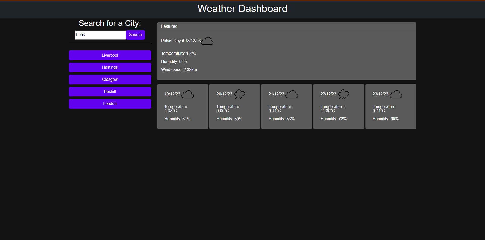

# weather-dashboard
A weather report page that outputs todays weather report and the next 5 days for any given city.
Link to Webpage: https://josh484.github.io/work-day-scheduler/
## Description 
This project mainly highlights my understanding of APIs and how they work in tandem with my projects. For this project I have used the weatherapi in order to get the location of the city that the user inputs and then get the weather data for that city and output the weather data for the next 5 days for that city. 
## Installation
In order to install the project simply click the green code button and download the file as a zip. 
Once downloaded simply right click on the file and unzip the folder.
## Usage 
Once the file is downloaded you can open the index.html on your web browser you will be met with this page:
.
## Features
This section goes over mainly the javascript used to create the website.
- Firstly we have two functions at document ready
1. A get search function which takes if any data in the local storage and stores them inside an array, This is to save previous searches.
2. A function that takes the array and then outputs it as a series of buttons with a value of a country. When that button is clicked it will show the user weather data pertaining to that country.
- Secondly, There is a event listener for the search button which takes in the value of the search bar. This event listener activates a variety of functions. 
1. A function to empty everything within divs of weather data.
2. Get country passing on the value of the search bar. Where it takes the city the user puts in then gets the longitude and latitude of that city and then finds the weather forecast for those values.
There is an if statement to ensure that if the user has already typed the city in the last 5 searches it will not show it as a button and then save that to local storage.
This function also takes induvidual data such as weather, date, temperature etc. and uses it for two functions. 
The two functions are for the featured forecast as in todays forecast and another function for the next 5 days. They do similar objectives where they print out the information to the HTML page but one does so 5x for each day using dayjs() to compare days and make sure it prints out weather data only once for each day.
3. Finally it finishes again with an update to the buttons search history to show the recent city searched before the current one.

